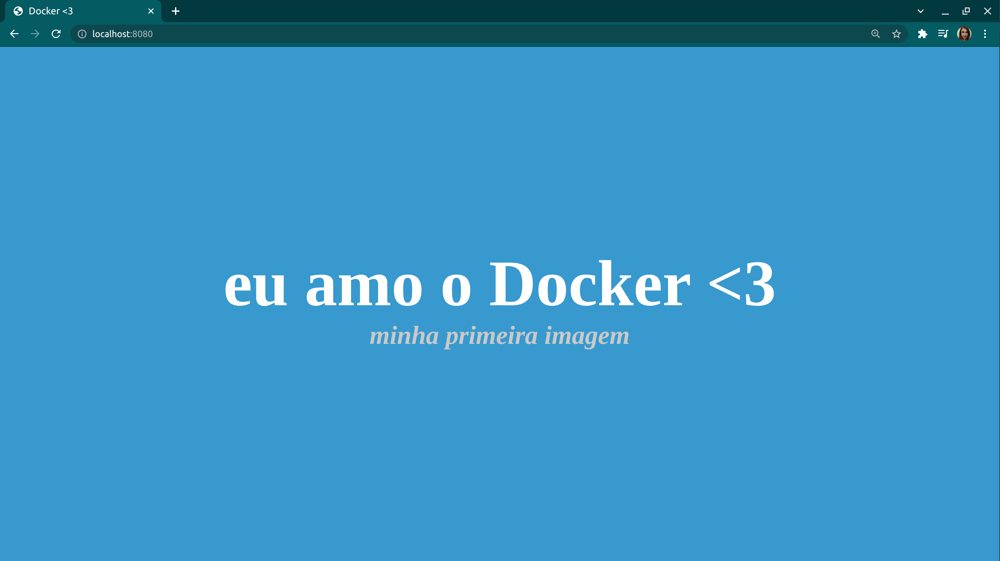

### Minha primeira imagem - Docker

<strong>Curso Alura:</strong> [Docker: Criando containers sem dor de cabeça](https://cursos.alura.com.br/course/docker-e-docker-compose)

<strong>Instrutor:</strong> [Douglas Quintanilha](https://www.linkedin.com/in/douglas-quintanilha/)

</br>

## Como utilizar esta imagem

A imagem está publicada no [Docker Hub](https://hub.docker.com/). 
Para baixá-la, basta rodar o comando no seu terminal:

```
docker pull mnfurtado/node 
```

Em seguida, crie um container a partir dessa imagem:

```
docker run -d -p 8080:3000 mnfurtado/node 
```

Por fim, acesse: http://localhost:8080/



</br>
<i><strong>Obs.:</strong> Para funcionar, é necessário que você tenha o Docker instalado na sua máquina.</i>